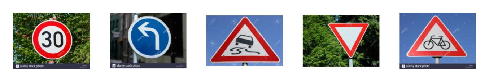
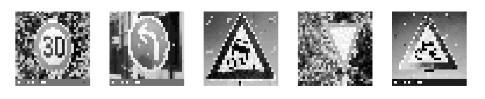

# Self-Driving-Cars
Creating `Autonomous cars` and simulations from basics of `Deep Learning` and `Computer Vision`.

# Topics:
- `Lane-Line Detection`
- `Traffic Signs Recognition System`
- `Polymomial Regression with Deep Learning`
- `Behavioural Cloning (Final project)`

# Lane-Line Detection:
### Animated GIF of Output video

# Traffic Signs Recognition System:
### Original Images:

### Preprocessed Images:

# Polynomial Regression with Deep Learning:

# Behavioural Cloning:
### Self-Driving Car Simulation powered by Udacity

## References:
- [The Complete Self-Driving Car Course- Applied Deep Learning (Udemy)](https://www.udemy.com/course/applied-deep-learningtm-the-complete-self-driving-car-course)
- [Tensorflow.org](https://www.tensorflow.org)
- [Stackoverflow](https://www.stackoverflow.com)
- [StackExchange](https://stackexchange.com)
- [Github Forums](https://github.com/topics/forums)
- [OpenCV.org](https://opencv.org)
- [PyPi.org](https://pypi.org)
